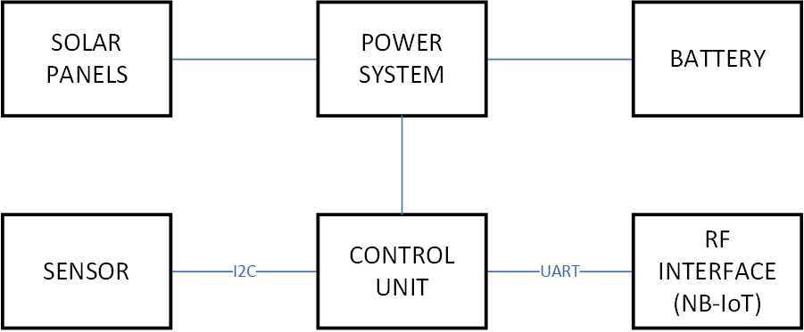
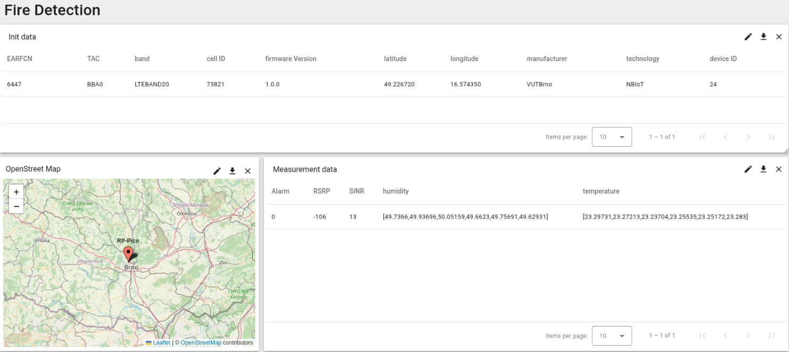
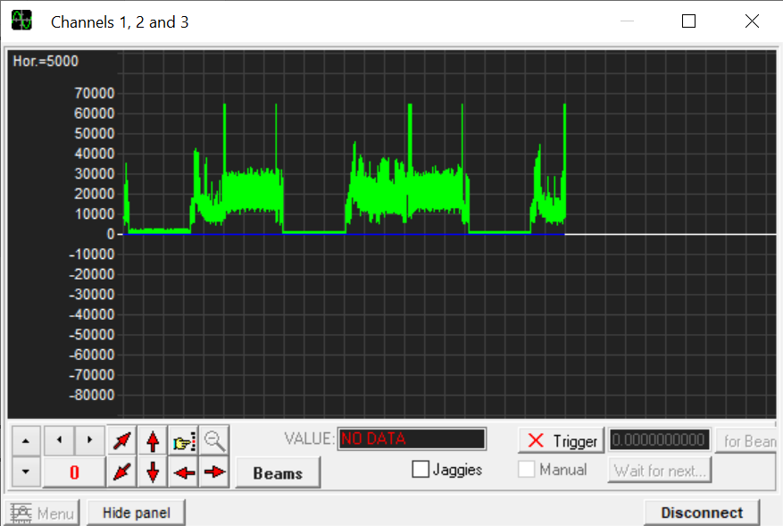
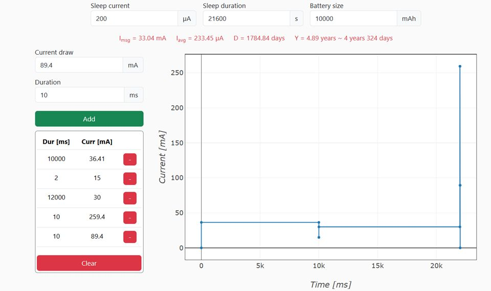

# Fire_detection
The aim of this work is to create a forest fire detector that monitors environment temperature and humidity every 30 minutes. Every 6 hours, these measurements are sent to server. In case of temperature exceeding threshold of 40 °C, detector ignores specified transmission windows and sends alarm warning immediately. False alarm recognition is implemented as well. 

## Wireless technology 
The maximum payload (user data) is relatively small and consists of 24 floats and alarm bit. In addition, the detector is located in remote area. That is why the Narrowband IoT (NB-IoT) technology was selected. Its robustness, good coverage and low consumption will be advantage in this case.

## Transport and application layer
When deciding transport layer, we desired as small overhead as possible. That’s why the UDP was selected. The first approach included also CoAP at application layer for its convenient high level handling, which unfortunately proved troublesome later, as it would require us to define packet format for module NB-IoT. On the other hand, by implementing CoAP we would unnecessarily increase the data throughput. That's why we used proxy, which cast received JSON to CoAP and sends it to ThigsBoard. Proxy also confirms sucessful receive of message by sending "OK" as ACK. Pure UDP protocol is used between module and proxy. For decreasing amount of data custom protocol could be used (1st bit alarm, 9 bits for RSRP, 8 bits for SINR, 8 bits for decimal part of first temperature, ...), decoding of cutom protocol would be in a proxy.

Once sensor measures data, they are sent to ThingsBoard platform. Data payload consists of alarm bit, RSRP (Reference Signal Received Power), SINR (Signal to Interference & Noise Ratio), length of array(s), temperature and humidity arrays. Before any payload can be sent, communication to the ThingsBoard has to be initialized first.

## PSM
Great amount of energy can be saved by putting the BG77 RF module to power sleep mode (PSM) between the 6-hour intervals. Sleep is interrupted when 12 measurements in 30 minutes period are performed or if one measurement proved to be above alarm's threshold. 

Such long intervals are not appropriate for testing, therefore limiting them to reasonable values will provide us with desired feedback. Proposed ranges of counters were:
-	Active Time: T3324 = 2 s,
-	TAU: T3412 = 5 min = 300 s,  

but network has provided us with:
-	Active Time: T3324 = 2 s,
-	TAU: T3412 = 4200 s.

## Sensor
Temperature and humidity are measured by AHT20 sensor, controlled by I2C bus. Sensor measures temperatures in range from -40 °C to 80 °C with accuracy of	&plusmn;0.3 °C (temperature) and &plusmn;2 % (humidity). Data are then allocated to array. After every successful measurement, temperature is evaluated, whether to fire an alarm or not. 

## Power supply 
Current draw of development kit (board) was measured at 89,4 mA. While in sleep mode (PSM) the system draws around 200 &micro;A. To cover consumption, for instance a solar 600mW solar supplying a pair of Li-Ion batteries (18650) with 10000mAh capacity should be used.
10 seconds is time for connecting after PSM, it takes 36.4 mA, then it transmites in 10 ms with 259.4 mA and receives ACK in 10 ms with 89.4mA and stays 12 s in RRC Connected with 30 mA consumption. There would be optimization for lower consumption using release assistance indicator (RAI) 2. For that there must be changed function receive in library BG77.py, because it misbehave with RAI = 2 (It cannot receive message).

